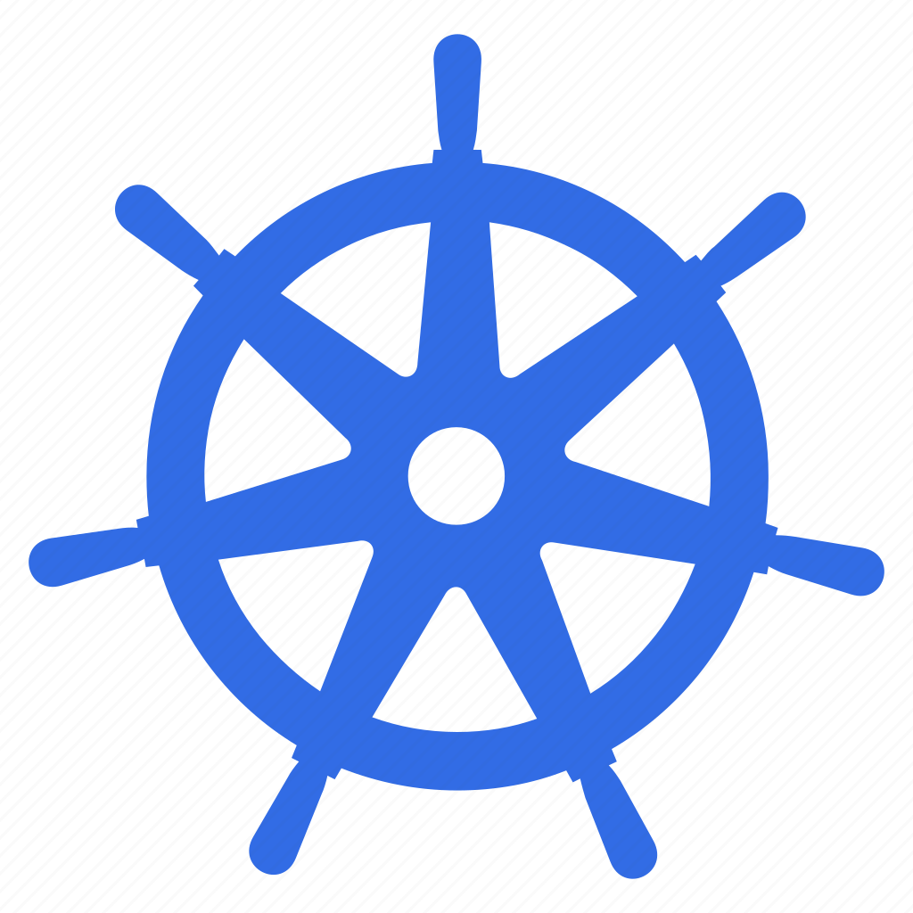

<a href="#"></a>

# What is the Valse?

Valse is an kubernetes exporter application that discovers resources such as version, namespaces, node, pod, deployment, daemonset, statefulset, service and jobs on kubernetes and feeds a mongodb.

# Use Cases

For envoy middleware load balancers used in Hepsiburada, it has been started to be written to dynamically add kubernetes worker node ip informations to envoy upstreams. Afterwards, with the discovery of other kubernetes resources, we added another page to our central healthcheck screens where we can see more than 160 kubernetes clusters from the top.

# Configmap

```
Cluster:  
  # Kubernetes cluster name
  Name: "devops-k8s-av"
  # Kubernetes cluster region
  Region: "europe"

# Interval the Kubernetes resouce discovery will be made
ScheduledTaskIntervalSeconds: 10   

# Exclude some namespaces from Kubernetes resouce discovery
ExcludedNamespaces: ""

# If project run locally and want to use default kubeconfig set this value true.
# If app will run in kubernetes cluster, this value must be false.
Client:
  InClusterConfig: true

# Provide mongodb for writing discovered kubernetes resources. Mongodb could be single node or cluster.
Mongodb:
  Hosts: [ "", "", "" ]
  Username: 
  Password: 
  Port: 
  Database: ""
  ReplicaSet: ""
  TimeoutSeconds: 10
```

# Building
For the production build just build the docker image.

```
$ docker build -t valse:0.1.0 -f Dockerfile . 

```
Building Helm package

```
$ helm package chart/valse --version 0.1.0 --app-version 0.1.0
```

# Deployment

First of all, the configmap must be edited! Provide mongodb for writing discovered kubernetes resources. 

```
$ vim ./k8s/configmap.yaml
```

It can be deployed with the helm chart or deployment manifests. 

```
$ kubectl apply -f .k8s/.
```

